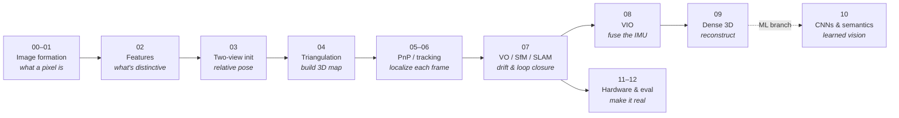

# Computer Vision Crash Course

A compact, teachable tour of **classical (geometry-based) computer vision**, built
around one question asked at ever-increasing levels of abstraction:

> **Where is the camera, and what is it looking at?**

We start with a single ray of light hitting a sensor and end with a camera that
localizes itself in, and reconstructs, a 3D world it has never seen before. The
spine of the course is the classical **Visual Odometry / SLAM** pipeline; the
machine-learning side is treated as a branch that grows off that spine, not as the
trunk.

> 📷 The course grew out of a whiteboard sketch of this pipeline — the original
> reference photo lives at [`assets/whiteboard.jpeg`](assets/whiteboard.jpeg).

## The through-line

Each module answers the same question with more capability than the last:



## Table of contents

| # | Module | What it answers |
| --- | --- | --- |
| 00 | [Image Formation](notes/00_image_formation.md) | Light, the pinhole model, intrinsics `K`, distortion |
| 01 | [Image Primitives](notes/01_image_primitives.md) | Convolution, gradients, edges (Canny), corners (Harris), scale space |
| 02 | [Features](notes/02_features.md) | Detect → describe → match; invariance; SIFT-era descriptors |
| 03 | [Two-View Geometry](notes/03_two_view_geometry.md) | Epipolar geometry, F/E, 8-point, homography, **RANSAC** |
| 04 | [Triangulation](notes/04_triangulation.md) | DLT, `AX=0` via SVD, reprojection refinement — the 3D map |
| 05 | [PnP & Tracking](notes/05_pnp_tracking.md) | 3D–2D PnP, P3P, EPnP, scale ambiguity |
| 06 | [Optical Flow](notes/06_optical_flow.md) | Lucas–Kanade, KLT vs match-every-frame |
| 07 | [VO / SfM / SLAM](notes/07_vo_sfm_slam.md) | Bundle adjustment vs pose-graph, drift, loop closure, DBoW |
| 08 | [Sensor Fusion & VIO](notes/08_sensor_fusion_vio.md) | IMU integration, scale, EKF vs factor-graph, calibration |
| 09 | [3D Reconstruction](notes/09_3d_reconstruction.md) | Stereo, MVS, point cloud → mesh → TSDF, NeRF & Gaussian Splatting |
| 10 | [CNNs & Semantics](notes/10_cnns_and_semantics.md) | Learned features (SuperPoint/SuperGlue), detection, segmentation |
| 11 | [Hardware](notes/11_hardware.md) | Shutters, sync, sensor trade-offs, calibration |
| 12 | [Evaluation](notes/12_evaluation.md) | Datasets (KITTI/EuRoC/TUM), metrics (ATE/RPE) |

## How to read this

- **Linearly** — each module ends with a `Next →` link and assumes the previous ones.
- **As reference** — every module is self-contained, bullet-led, and closes with a
  one-line **key takeaway**.
- **The geometric core is 03 → 04 → 05.** If you only read three modules, read those:
  they are the two-view initialization, the map-building step, and the per-frame
  tracking step that together *are* visual odometry.
- Math renders as GitHub LaTeX (`$$…$$`); pipeline diagrams use Mermaid; geometric
  figures are generated PNGs (see below).

## Figures

Flow diagrams are inline [Mermaid](https://mermaid.js.org/). Geometric figures
(pinhole model, epipolar geometry, triangulation, P3P) are **generated from code** in
[`figures/`](figures/) so they stay reproducible — both the scripts and the output
PNGs in [`assets/generated/`](assets/generated) are committed.

Regenerate them all from the repo root:

```bash
for f in figures/*.py; do [ "$(basename "$f")" = _style.py ] || python3 "$f"; done
```

Requires `pip install matplotlib numpy`. See [`figures/README.md`](figures/README.md).

## See it in action

A live monocular SLAM run — feature tracking, incremental mapping, and a loop closure
snapping the trajectory back into global consistency — ties the whole spine together:

▶️ **https://www.youtube.com/watch?v=Lc7VQHngSuQ**

## Further resources

- **Vision Algorithms for Mobile Robotics (VAMR) — Davide Scaramuzza, UZH**
  ([rpg.ifi.uzh.ch](https://rpg.ifi.uzh.ch/teaching.html#VAMR)).
  The course I followed, and the main inspiration for this crash course — the
  definitive treatment of the classical VO/SLAM material covered here.
- **ARIA Robotics — `robotic-mapping` lecture series**
  ([github.com/ariarobotics/robotic-mapping](https://github.com/ariarobotics/robotic-mapping)).
  A strong companion reference for the geometry/mapping side of this course. In
  particular, the image-formation lecture pairs directly with module 00:
  [`lectures/Lec03_Image.pdf`](https://github.com/ariarobotics/robotic-mapping/blob/main/lectures/Lec03_Image.pdf).

---

*Classical CV crash course — geometry first, learning as a branch.*
