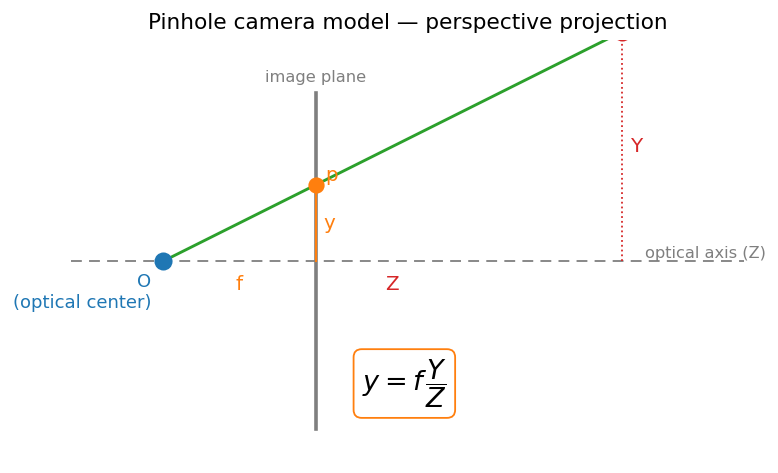
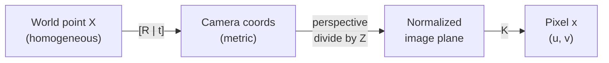

# 00 — Image Formation

This module opens the classical Visual-Odometry/SLAM spine: *where is the camera and what is it looking at, at increasing levels of abstraction.* Before we can estimate motion or reconstruct structure, we need a model of how a 3D world point becomes a 2D pixel. Image formation is that model — the equation that every later geometry module inverts.

## Light and the Visible Spectrum

- A camera is a **light-integrating device**: a sensor counts photons arriving in each pixel well over an exposure time.
- Human-relevant cameras sample the **visible band** (~380–750 nm) because that is where silicon sensors are sensitive and where common illuminants (sun, indoor lighting) emit strongly.
- A color filter array (e.g. Bayer pattern) splits incoming light into R/G/B channels; grayscale intensity is a weighted sum. For geometry we mostly care about **intensity gradients**, not color.
- Key consequence: pixel values depend on scene radiance *and* illumination. This is why later feature descriptors strive for **illumination invariance** — the geometry must survive lighting changes.

## The Pinhole Camera Model

- Idealize the lens as a single point (the **optical center** / center of projection). Every scene ray passes through it and strikes the image plane.
- By **similar triangles**, a 3D point at depth $Z$ with height $X$ projects to image coordinate $x = f \, X / Z$. Depth divides — this is the origin of *perspective*: distant things look smaller.

*Similar-triangles geometry of the pinhole: the ray from a world point through the optical center meets the image plane at a scaled position.*

$$
x = f\frac{X}{Z}, \qquad y = f\frac{Y}{Z}
$$

- These equations are **nonlinear** (division by $Z$). Homogeneous coordinates turn them back into linear algebra.

## Homogeneous Coordinates

- Append a 1: a 2D point becomes $\tilde{x} = (x, y, 1)^\top$, a 3D point $\tilde{X} = (X, Y, Z, 1)^\top$.
- Points are defined **up to scale**: $(x, y, 1) \sim (\lambda x, \lambda y, \lambda)$. Projection becomes a matrix multiply followed by dividing through by the last coordinate.
- This lets perspective projection, rotation, and translation all compose as matrix products — the workhorse of multi-view geometry.

## Camera Intrinsics K

- Real sensors measure in **pixels**, not metric units, and the principal axis may not hit the image center. The **intrinsics matrix** $K$ encodes this:

$$
K = \begin{bmatrix} f_x & s & c_x \\ 0 & f_y & c_y \\ 0 & 0 & 1 \end{bmatrix}
$$

- $f_x, f_y$: focal lengths in pixels (different if pixels are non-square).
- $c_x, c_y$: **principal point**, where the optical axis pierces the image.
- $s$: skew, almost always $0$ for modern sensors.
- $K$ maps **normalized camera coordinates** (metric, $Z=1$ plane) to pixel coordinates.

## The Full Projection Equation

- Combine the rigid-body pose (extrinsics $R, t$) that places the world in the camera frame with the intrinsics:

$$
\tilde{x} = K \,[\,R \mid t\,]\, \tilde{X}
$$

- $[R \mid t]$ is the $3\times4$ **extrinsic matrix**: $R$ rotates, $t$ translates the world point into the camera frame. The product $P = K[R\mid t]$ is the $3\times4$ **camera projection matrix**.
- This single equation *is* the answer to "where is the camera ($R,t$) and what is it looking at ($X$)." SLAM/VO estimate the unknowns on the right from observed $\tilde{x}$.

## Lens Distortion and Undistortion

- Real lenses bend rays, breaking the straight-line pinhole assumption. Two dominant effects:
  - **Radial distortion** — straight lines bow outward (barrel) or inward (pincushion), growing with radius $r$ from the center.
  - **Tangential distortion** — from lens/sensor misalignment.
- A common (Brown–Conrady) radial model on normalized coordinates:

$$
x_d = x\,(1 + k_1 r^2 + k_2 r^4 + k_3 r^6), \qquad r^2 = x^2 + y^2
$$

- We **undistort** (resample the image, or correct point coordinates) so the clean $x = K[R\mid t]X$ model holds. Every downstream geometry step assumes an undistorted, calibrated camera.

> **Key takeaway:** Image formation is the projection $x = K[R\mid t]X$ — a calibrated pinhole that turns the 3D question "where is the camera and what does it see" into linear algebra in homogeneous coordinates.

[Index](../README.md) · [Next → 01 Image Primitives](01_image_primitives.md)
