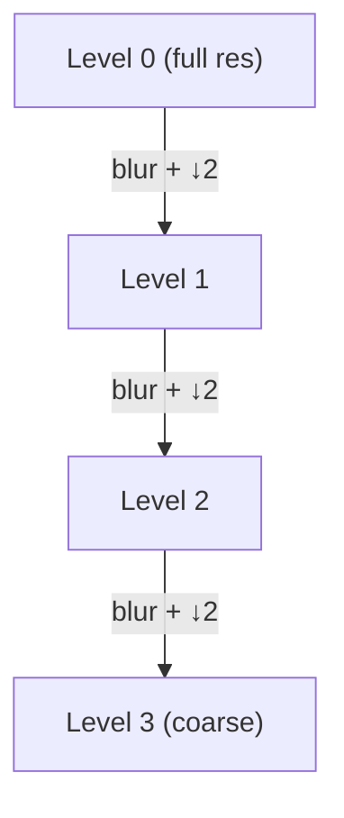

# 01 — Image Primitives

With image formation fixed, we descend one level on the VO/SLAM spine: *what is the camera looking at?* The answer starts with local structure — edges, corners, scales — extracted directly from pixels. These primitives are the raw signal that feature detectors (next module) turn into the correspondences geometry depends on.

## Convolution: The Basic Operation

- Almost every low-level operation is a **convolution**: slide a small kernel $h$ over the image $I$, output a weighted sum of the neighborhood.

$$
(I * h)(x, y) = \sum_{i}\sum_{j} I(x-i,\, y-j)\, h(i, j)
$$

- Linear, shift-invariant, and separable kernels (e.g. Gaussian) let us blur, sharpen, or differentiate cheaply.
- Intuition: the kernel is a **template**; convolution measures local agreement with that pattern at every pixel.

## Image Gradients (Sobel)

- Structure lives in **intensity change**. The gradient $\nabla I = (I_x, I_y)$ points toward steepest increase; its magnitude flags edges.
- **Sobel** estimates derivatives with smoothing built in (noise-robust):

$$
G_x = \begin{bmatrix} -1 & 0 & 1 \\ -2 & 0 & 2 \\ -1 & 0 & 1 \end{bmatrix} * I,
\qquad
G_y = G_x^\top * I
$$

- Edge strength $\lVert\nabla I\rVert = \sqrt{G_x^2 + G_y^2}$, orientation $\theta = \operatorname{atan2}(G_y, G_x)$.

## Edges and the Canny Pipeline

- A raw gradient magnitude gives thick, noisy ridges. **Canny** turns them into clean, thin, connected edges in four stages:

- **Smooth** with a Gaussian to suppress noise (noise has huge derivatives).
- **Gradient** magnitude and direction via Sobel.
- **Non-maximum suppression**: keep a pixel only if it is a local maximum *along the gradient direction* — thins ridges to 1-pixel edges.
- **Hysteresis thresholding**: two thresholds. Pixels above `high` are strong edges; pixels above `low` are kept only if connected to a strong edge. This bridges gaps without admitting noise.

## Corners and the Harris Detector

- Edges are ambiguous *along* their direction (the aperture problem). **Corners** — intensity changing in *two* directions — are localizable and therefore good trackable features.
- Consider the windowed self-similarity under a shift $(u,v)$. A second-order expansion gives the **structure (second-moment) matrix**:

$$
M = \sum_{\text{window}} w(x,y)
\begin{bmatrix} I_x^2 & I_x I_y \\ I_x I_y & I_y^2 \end{bmatrix}
$$

- The eigenvalues $\lambda_1, \lambda_2$ of $M$ describe local structure: both small = flat, one large = edge, both large = corner.
- Harris avoids eigen-decomposition with the **corner response**:

$$
R = \det(M) - k\,\operatorname{tr}(M)^2, \qquad k \approx 0.04\text{–}0.06
$$

- $R > 0$ and large → corner; $R < 0$ → edge; $|R|$ small → flat. Threshold $R$ and apply non-max suppression to pick keypoints.

## Scale Space and Image Pyramids

- A corner at one zoom level may vanish at another — real scenes contain structure at **many scales**. Robust vision must be **multi-scale**.
- **Gaussian pyramid**: repeatedly blur and downsample. Each level halves resolution; together they sample a continuous **scale space** $L(x,y,\sigma) = G_\sigma * I$.
- **Laplacian pyramid** (difference of adjacent Gaussian levels, $\approx$ band-pass) highlights blobs/detail at each scale and is the basis of DoG keypoint detection in the next module.
- Why it matters: detecting features across scales gives **scale invariance** — a feature found in a close-up still matches the same feature seen from far away.

> **Key takeaway:** Convolution-based gradients give edges (Canny) and corners (Harris $R = \det M - k\,\mathrm{tr}(M)^2$), and computing them across a scale-space pyramid yields the repeatable, multi-scale primitives that features are built from.

[← 00 Image Formation](00_image_formation.md) · [Index](../README.md) · [Next → 02 Features](02_features.md)
