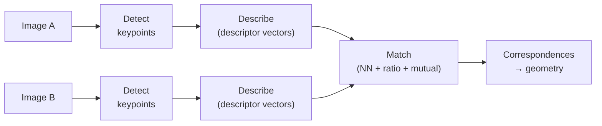

# 02 — Features

We now reach the abstraction the whole VO/SLAM spine pivots on: *features.* A feature is a distinctive image location plus a description that lets us recognize the **same world point across different images.** Every later geometry module — two-view geometry, triangulation, pose estimation, bundle adjustment — consumes these correspondences as its raw material. Get them right and the geometry is solvable; get them wrong and nothing downstream can recover.

## The Detect → Describe → Match Pipeline

- The classical feature workflow has three stages, each a separate algorithm:

- **Detect**: find repeatable, well-localized keypoints (corners, blobs).
- **Describe**: summarize the patch around each keypoint as a vector that is robust to nuisance changes.
- **Match**: pair descriptors between images to establish correspondences.

## What Makes a Good Feature

- **Repeatable** — detected at the same physical point despite viewpoint, scale, or lighting change. Without repeatability there is nothing to match.
- **Distinctive** — its descriptor is far from unrelated patches, so the correct match stands out.
- **Localized** — precise sub-pixel position (geometry error scales with localization error).
- **Efficient** — fast enough for real-time VO/SLAM.

## Invariance and Robustness

- Real image pairs differ in **viewpoint, scale, rotation, and illumination**. Good features build in invariance:
  - *Scale* — detect across a scale space / pyramid and record each keypoint's characteristic scale.
  - *Rotation* — assign a **dominant orientation** and describe relative to it.
  - *Illumination* — use gradients (not raw intensity) and **normalize** the descriptor.
- Invariance is never free: more invariance usually costs distinctiveness. The art is matching invariance to the expected nuisances.

## SIFT-Era Descriptors

- **SIFT** is the canonical pipeline and worth knowing in detail:
  1. **DoG keypoints** — approximate the scale-normalized Laplacian by a **Difference of Gaussians** across the pyramid; extrema in $(x, y, \sigma)$ are scale-invariant keypoints.
  2. **Dominant orientation** — build a histogram of gradient orientations in the patch; the peak fixes a reference angle, giving rotation invariance.
  3. **Descriptor** — a $4\times4$ grid of 8-bin gradient-orientation histograms = a **128-D** vector, then normalized for illumination robustness.
- Variants trade accuracy for speed:
  - **SURF** — box-filter / integral-image approximation of SIFT; faster.
  - **BRIEF** — binary descriptor from intensity-comparison tests; Hamming-distance matching, but not rotation/scale invariant on its own.
  - **ORB** — oriented FAST keypoints + rotation-aware BRIEF; fast, binary, license-free — the default in many real-time SLAM systems (e.g. ORB-SLAM).

## Matching

- Match by **nearest neighbor in descriptor space** (Euclidean for SIFT/SURF, Hamming for binary ORB/BRIEF).
- **Lowe's ratio test** — accept a match only if the closest neighbor is decisively better than the second-closest:

$$
\frac{d_1}{d_2} < \tau, \qquad \tau \approx 0.7\text{–}0.8
$$

This rejects ambiguous matches in repetitive texture — the single most effective outlier filter.
- **Mutual (cross) check** — keep a match only if $a \to b$ is the best match *and* $b \to a$ is too. Symmetry removes one-directional false pairs.
- Even after these, some outliers survive; robust estimation (RANSAC, next modules) cleans the rest while fitting geometry.

> **Key takeaway:** Features turn pixels into matchable identities via detect→describe→match, and the resulting reliable correspondences — filtered by Lowe's ratio and mutual checks — are the raw material every later geometry module consumes.

[← 01 Image Primitives](01_image_primitives.md) · [Index](../README.md) · [Next → 03 Two-View Geometry](03_two_view_geometry.md)
