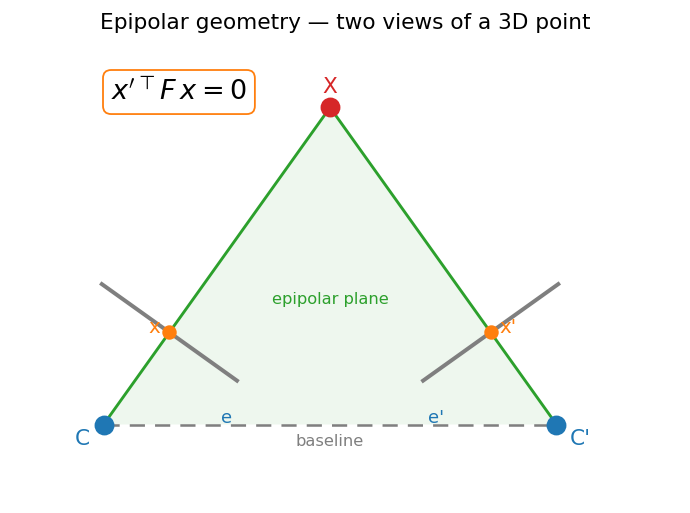
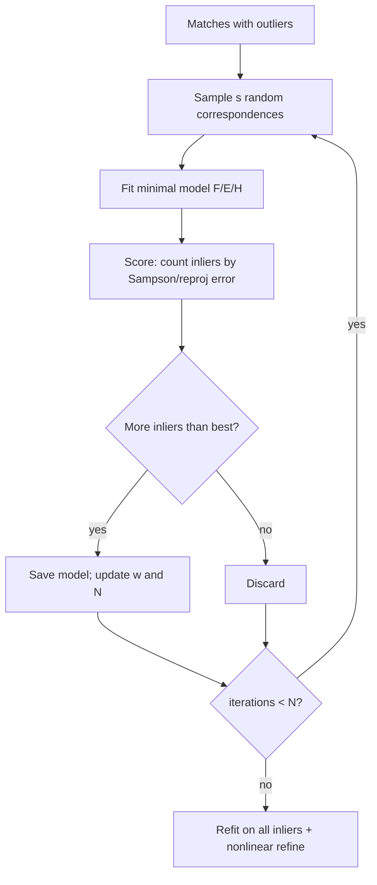

# 03 — Two-View Geometry

This module is the **two-view initialization** of the classical Visual-Odometry / SLAM spine: *where is the camera and what is it looking at, at increasing levels of abstraction.* Having gone from image formation (01) to features and matches (02), we now ask: given two images of the same rigid scene and a set of point correspondences, what is the **relative pose** between the two cameras? This is the bootstrap step — it gives us the first camera motion and the geometric constraint that later lets us build a 3D map (04) and track against it (05).

## The setup

- Two cameras observe the same 3D point $X$. It projects to $x$ in the first image and $x'$ in the second (homogeneous pixel coordinates).
- The two camera centers $C, C'$ and the point $X$ form a plane — the **epipolar plane**. All the geometry below is a consequence of this single coplanarity fact.
- We want the rotation $R$ and translation $t$ that map frame 1 to frame 2. With a single calibrated pair we can recover them up to an unknown scale on $t$.

*Two views of a point: the epipolar plane intersects each image in an epipolar line, and all lines pass through the epipole.*

## Epipolar geometry

- **Epipole** $e$ ($e'$): the projection of the *other* camera's center into this image. It is where the baseline $CC'$ pierces the image plane.
- **Epipolar line**: the image of the back-projected ray from the other view. The point $x$ constrains its match $x'$ to lie on a *line* $l' = F x$, not a full 2D search.
- **Epipolar constraint** — the load-bearing equation. For every true correspondence:

$$ x'^\top F\, x = 0 $$

This says $x'$ lies on the epipolar line $Fx$, and dually $x$ lies on $F^\top x'$. All epipolar lines in an image pass through that image's epipole, so $F e = 0$ and $F^\top e' = 0$ — the epipoles are the right/left null vectors of $F$.

## Fundamental vs. essential matrix

- $F$ (the **fundamental matrix**, $3\times3$, rank 2, 7 DOF) encodes the epipolar geometry in **pixel** coordinates. It needs no calibration — purely a relationship between image points.
- If the intrinsics $K, K'$ are known, work in **normalized camera coordinates** $\hat{x} = K^{-1}x$. The constraint becomes $\hat{x}'^\top E\, \hat{x} = 0$ with the **essential matrix**:

$$ E = [t]_\times R, \qquad E = K'^\top F K $$

- $[t]_\times$ is the skew-symmetric matrix of $t$, so $[t]_\times R$ is "cross with the baseline, then rotate." $E$ has 5 DOF (3 for $R$, 2 for the direction of $t$ — its magnitude is lost). Its singular values are $(\sigma,\sigma,0)$ — a defining property used to clean up noisy estimates.

## The normalized 8-point algorithm (estimating F)

Each correspondence $(x,x') = (u,v,1),(u',v',1)$ gives one linear equation in the 9 entries of $F$. Stacking $n\ge 8$ rows:

$$ A f = 0,\quad A_i = [\,u'u,\ u'v,\ u',\ v'u,\ v'v,\ v',\ u,\ v,\ 1\,],\quad f=\mathrm{vec}(F) $$

1. **Normalize** (Hartley): translate each image's points to zero mean and scale so the mean distance to the origin is $\sqrt{2}$. This conditioning is *essential* — without it the solution is numerically garbage. Apply $T, T'$ and undo at the end: $F = T'^\top \hat F T$.
2. **Solve** $Af=0$ by SVD: $f$ is the right singular vector of $A$ with the smallest singular value.
3. **Enforce rank 2**: the raw $\hat F$ is full rank from noise. SVD it as $U\,\mathrm{diag}(\sigma_1,\sigma_2,\sigma_3)\,V^\top$ and zero the smallest: $\hat F \leftarrow U\,\mathrm{diag}(\sigma_1,\sigma_2,0)\,V^\top$. A valid fundamental matrix *must* be singular (epipoles exist).

For $E$ with calibrated cameras, the analogous **5-point algorithm** uses the extra constraints and is the standard minimal solver.

## Recovering R, t from E

- SVD $E = U\,\mathrm{diag}(1,1,0)\,V^\top$. With $W = \begin{bmatrix}0&-1&0\\1&0&0\\0&0&1\end{bmatrix}$, the two rotations and translation direction are:

$$ R \in \{\,U W V^\top,\ U W^\top V^\top\,\},\qquad t = \pm\, u_3 \ (\text{last column of }U) $$

- This yields a **four-fold ambiguity**: 2 rotations $\times$ 2 translation signs. Geometrically these correspond to the scene in front of vs. behind each camera and a baseline flip.
- **Cheirality check** disambiguates: triangulate a correspondence under each of the 4 candidates and keep the one where the 3D point has **positive depth in both cameras**. Only one solution places the scene in front of both. (Force $\det R = +1$; if $\det(UWV^\top) = -1$, negate.)

## Homography for planar scenes / pure rotation

- When all points lie on a **plane**, or the camera undergoes **pure rotation** (no translation), the epipolar geometry degenerates — $F$ is ill-conditioned. The right model is a $3\times3$ **homography** $H$:

$$ x' \simeq H x \qquad (\text{equality up to scale}) $$

- Estimate $H$ by DLT from $\ge 4$ correspondences (each gives 2 equations). In an init pipeline, fit **both** $F$ and $H$, score them, and pick the model that explains the data — this avoids degenerate initialization on planar or low-parallax scenes (the ORB-SLAM strategy).

## RANSAC — the robust estimator that makes all of this work

Feature matches contain **outliers** (wrong matches). A single bad correspondence wrecks a least-squares $F$. RANSAC fits to *minimal samples* and lets the data vote.

- **Minimal sample size** $s$: 8 (or 7) points for $F$, 5 for $E$, 4 for $H$.
- **Score**: count **inliers** — correspondences whose error is below a threshold. Use a geometrically meaningful distance:
  - **Sampson distance** (first-order approximation of reprojection error for $F$):

  $$ d_{\text{Samp}} = \frac{(x'^\top F x)^2}{(Fx)_1^2 + (Fx)_2^2 + (F^\top x')_1^2 + (F^\top x')_2^2} $$

  - For $H$: symmetric **reprojection/transfer error** $\|x' - Hx\|^2 + \|x - H^{-1}x'\|^2$.
- **Adaptive iteration count**: with inlier ratio $w$ and target success probability $p$,

$$ N = \frac{\log(1-p)}{\log\!\big(1-w^{s}\big)} $$

  Update $w$ from the best inlier set found so far and shrink $N$ on the fly — cheaper when the data is clean, more iterations when it's dirty.
- **Refit**: once the best minimal model is found, re-estimate on **all inliers** (the normalized 8-point on the inlier set), often followed by nonlinear refinement.

## Where this leaves us

- Output of two-view init: relative pose $(R, t)$ with **unit-norm translation** (scale unknown), plus a clean inlier set of correspondences.
- Those inliers, with the recovered pose, are exactly the input to **triangulation** (04), which turns 2D matches into the first batch of 3D map points.

> **Key takeaway:** The epipolar constraint $x'^\top F x = 0$ reduces matching to a line search and lets us recover relative pose from $E=[t]_\times R$ — but only RANSAC makes that estimate survive real, outlier-laden correspondences.

[← 02 Features](02_features.md) · [Index](../README.md) · [Next → 04 Triangulation](04_triangulation.md)
