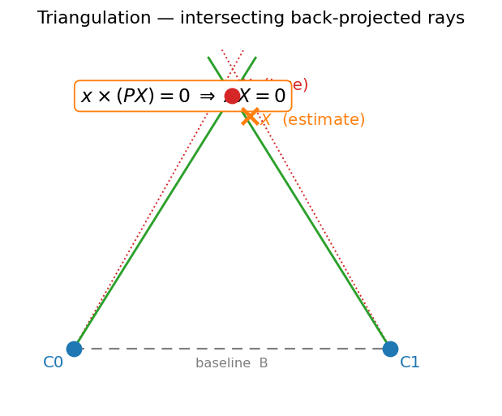

# 04 — Triangulation

This module is the **map-building** step of the classical Visual-Odometry / SLAM spine: *where is the camera and what is it looking at.* Two-view geometry (03) gave us the relative pose $(R, t)$ between two cameras. Triangulation is the inverse of projection — it takes a 2D correspondence seen in both views and recovers the single 3D point $X$ that produced it. This is how the first 3D map is born; once we have map points, frame-to-frame tracking by PnP (05) becomes possible.

## The problem

- A 3D point $X$ projects to $x = PX$ in view 1 and $x' = P'X$ in view 2, where $P = K[I\,|\,0]$ and $P' = K'[R\,|\,t]$ are the $3\times4$ projection matrices.
- We **know** $P, P', x, x'$ and want $X$. In the noise-free case the two back-projected rays meet exactly at $X$. With noise they are **skew** — they don't intersect — so triangulation becomes an estimation problem: find the $X$ most consistent with both rays.

*Two rays back-projected from corresponding image points meet (or, under noise, nearly meet) at the 3D point $X$.*

## Linear triangulation via DLT

The key trick: the projection $x \simeq PX$ is an equality **up to scale**, so $x$ and $PX$ are parallel and their cross product vanishes:

$$ x \times (P X) = 0 $$

Writing $P$ by its rows $p^{1\top}, p^{2\top}, p^{3\top}$ and $x=(u,v,1)$, the cross product gives three equations of which two are independent:

$$ u\,(p^{3\top}X) - (p^{1\top}X) = 0, \qquad v\,(p^{3\top}X) - (p^{2\top}X) = 0 $$

Each view contributes 2 such rows. Stack both views into a $4\times4$ system in the homogeneous unknown $X$:

$$ A X = 0,\qquad
A = \begin{bmatrix}
u\,p^{3\top} - p^{1\top}\\
v\,p^{3\top} - p^{2\top}\\
u'\,p'^{3\top} - p'^{1\top}\\
v'\,p'^{3\top} - p'^{2\top}
\end{bmatrix} $$

- Solve the homogeneous system by **SVD**: $X$ is the **right singular vector corresponding to the smallest singular value** of $A$ (the best rank-deficient null-space direction).
- $X$ comes out **homogeneous** $(X,Y,Z,W)$; dehomogenize to $(X/W, Y/W, Z/W)$. If $W \approx 0$ the point is near infinity (see degeneracies).
- As in the 8-point algorithm, **normalize/condition** image coordinates first for numerical stability.

This is fast, closed-form, and a great initializer — but it minimizes an **algebraic** error (the entries of $AX$), not the geometrically meaningful reprojection error.

## Nonlinear reprojection refinement

The quantity we actually care about is the **reprojection error** — the pixel distance between the observed points and where the estimated $X$ projects:

$$ X^\star = \arg\min_{X}\ \big\| x - \pi(P X) \big\|^2 + \big\| x' - \pi(P' X) \big\|^2 $$

where $\pi(\cdot)$ is the perspective divide $(X,Y,Z)\mapsto(X/Z, Y/Z)$.

- This is a small **nonlinear least-squares** problem in 3 unknowns. Initialize with the DLT solution and refine with **Gauss–Newton** or **Levenberg–Marquardt**.
- Each iteration: compute the residual $r$, the Jacobian $J = \partial r/\partial X$, and solve the normal equations $(J^\top J + \lambda I)\,\delta = -J^\top r$, then update $X \leftarrow X + \delta$. LM's damping $\lambda$ interpolates between Gauss–Newton (fast near the minimum) and gradient descent (safe far from it).
- This per-point refinement is exactly the structure half of full **bundle adjustment**; doing it jointly over many points and poses is what module 07 generalizes to.

## Degeneracies and when triangulation fails

Triangulation quality is governed by **parallax** — the angle $\theta$ between the two rays at $X$.

- **Small baseline / low parallax**: when the cameras are close together (or the point is far away), the rays are nearly parallel. Depth becomes extremely sensitive to pixel noise — a sub-pixel error swings the estimate by meters. **Depth uncertainty scales roughly as $\propto 1/\theta$.**
- **Points near infinity**: a point at infinity gives parallel rays and $W \to 0$ in the homogeneous solution. Such points are still useful for estimating **rotation** (their bearing is well-defined) but carry no usable depth — keep them homogeneous rather than forcing a finite $(X,Y,Z)$.
- **Pure rotation**: zero baseline → no triangulation is possible at all (this is the degenerate case that motivates the homography branch in 03).
- **Practical guard**: reject a triangulated point if its parallax angle is below a threshold (e.g. ~1°), if it lands **behind** either camera (cheirality), or if its reprojection error exceeds a few pixels. These filters keep the map clean and feed only well-conditioned points to the tracker.

## Where this leaves us

- Output: a set of 3D map points $\{X_i\}$ in the (scale-ambiguous) world frame, each with a known 2D observation in the bootstrap frames.
- These points are the **reference map** that the next module uses: given new images of the same points, PnP (05) solves for the new camera pose — closing the loop from structure back to motion.

> **Key takeaway:** Triangulation inverts projection — DLT gives a closed-form null-space estimate of $X$ that nonlinear refinement sharpens — but its accuracy lives and dies by parallax, so low-baseline points carry little depth information.

[← 03 Two-View Geometry](03_two_view_geometry.md) · [Index](../README.md) · [Next → 05 PnP & Tracking](05_pnp_tracking.md)
