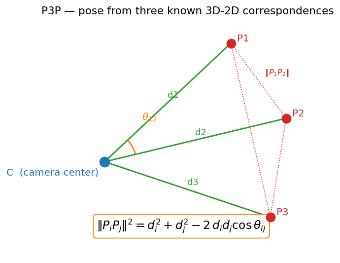
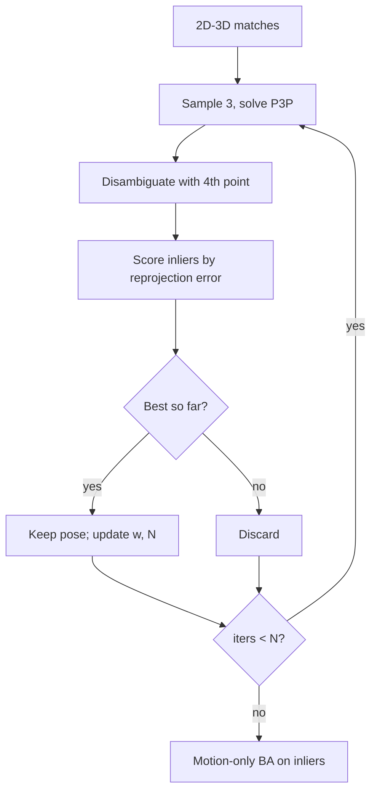

# 05 — PnP & Tracking

This module is the **per-frame tracking** step of the classical Visual-Odometry / SLAM spine: *where is the camera and what is it looking at.* Two-view init (03) gave a relative pose, and triangulation (04) turned matches into a 3D map. Now, for every new incoming frame, we have **known 3D map points** and their **2D observations** — and we solve for the camera's pose directly. This is the **Perspective-n-Point (PnP)** problem, the workhorse of frame-to-frame tracking, and it is what keeps the camera localized against the map between expensive re-initializations.

## The problem

- Given $n$ correspondences between 3D world points $X_i$ and their 2D image projections $x_i$, with **known intrinsics** $K$, find the rotation $R$ and translation $t$ such that:

$$ x_i \simeq K\,[R \mid t]\,X_i $$

- Unlike two-view geometry, the structure is *fixed* — we are solving only for the 6-DOF pose. With known 3D points the scale is fixed by the map, so PnP returns a **metric pose** (relative to whatever scale the map already has).

*The camera center, three known 3D points, the rays to them, and the inter-point angles that drive the law-of-cosines equations.*

## P3P — the minimal solver

Three correspondences are the minimum to constrain pose. P3P works in the **camera-center triangle**: let $d_i = \|C - X_i\|$ be the unknown distance from the camera center $C$ to point $X_i$, and let $\theta_{ij}$ be the angle between the rays to $X_i$ and $X_j$ (computed from the *normalized* image bearings $K^{-1}x_i$, hence **known**). The side lengths $\|X_i X_j\|$ are also known from the map. The **law of cosines** on each of the three triangles gives:

$$ \|X_i X_j\|^2 = d_i^2 + d_j^2 - 2\,d_i d_j \cos\theta_{ij} $$

- Three such equations (for pairs 12, 13, 23) in the three unknowns $d_1, d_2, d_3$. Eliminating variables reduces this to a single **quartic polynomial**, which has **up to 4 real solutions**.
- Each depth solution gives the 3D positions of the points in the camera frame, and pose $(R,t)$ follows from aligning them to the world frame (an absolute-orientation / Procrustes step).
- **Disambiguate with a 4th point**: project the candidates using each of the up-to-4 poses and keep the one with the smallest reprojection error on the extra correspondence.

P3P is fast and exact but uses only the minimal data — it is ideal as the **hypothesis generator inside RANSAC**, not as the final answer.

## EPnP — efficient PnP for many points

When $n$ is large, we want an estimator that is linear and uses all the data.

- **Idea**: express every 3D point as a weighted sum of **4 virtual control points** $c_j$ in **barycentric coordinates**:

$$ X_i = \sum_{j=1}^{4} \alpha_{ij}\, c_j, \qquad \sum_j \alpha_{ij} = 1 $$

- The same barycentric weights $\alpha_{ij}$ hold in the **camera frame**. The unknowns collapse from $n$ point depths to just the **4 control points in camera coordinates** (12 numbers).
- Each correspondence contributes linear constraints; stacking them gives a system whose solution lies in the null space of a $2n \times 12$ matrix. Recover the control points, hence all $X_i^{\text{cam}}$, then solve for $(R,t)$.
- **Complexity is $O(n)$** — linear in the number of points — which is why EPnP is the default dense PnP solver. A small nonlinear polish on the control points handles noise.

## Robust PnP: RANSAC + refinement

Real 2D–3D matches contain outliers (wrong data associations, dynamic objects). The estimation pipeline mirrors module 03:

1. **RANSAC with P3P**: sample 3 correspondences, solve P3P, score the pose by counting **inliers** — map points whose **reprojection error** $\|x_i - \pi(K[R\mid t]X_i)\|$ falls below a pixel threshold. Iterate $N = \log(1-p)/\log(1-w^3)$ times, adapting $N$ as the best inlier ratio $w$ improves.
2. **Refit (motion-only bundle adjustment)**: take the inliers from the best hypothesis and minimize total reprojection error over the **pose only** (structure held fixed):

$$ (R,t)^\star = \arg\min_{R,t} \sum_{i\in\text{inliers}} \big\| x_i - \pi\big(K[R\mid t]X_i\big) \big\|^2 $$

   Solve with Gauss–Newton / Levenberg–Marquardt, parameterizing the rotation on the $SO(3)$ manifold (e.g. a Lie-algebra $\mathfrak{so}(3)$ increment $\delta\boldsymbol{\omega}$) so updates stay valid rotations. A robust kernel (Huber) further down-weights residual outliers.

## Monocular scale ambiguity

- A **single moving camera** has a fundamental limitation: from images alone you cannot tell a large scene viewed from far away from a small scene viewed up close. The two-view translation came out only as a *direction* (03), so the entire reconstruction — poses and map — is determined only **up to one global scale factor**.
- PnP against an already-built map is *internally consistent*: it returns poses in the **same scale as that map**, so tracking does not introduce new ambiguity. But the absolute scale of the whole system remains unknown and can **drift** over long trajectories.
- Resolving scale requires an external cue: a **stereo rig** (known baseline), an **IMU** (metric acceleration), a known object size, or wheel odometry. This is the central reason monocular VO is reported "up to scale," and it sets up the **drift and loop-closure** discussion of the next modules.

## Where this leaves us

- Output per frame: a 6-DOF camera pose consistent with the map, plus a refreshed inlier set of 2D–3D matches.
- Repeated frame after frame, PnP *is* the odometry. But small per-frame errors accumulate — **drift** — which motivates loop closure and global optimization later in the spine.

> **Key takeaway:** PnP localizes each new frame against a known 3D map — P3P's law-of-cosines quartic seeds a RANSAC loop that motion-only bundle adjustment refines — but monocular VO recovers all of this only up to one unknown global scale.

[← 04 Triangulation](04_triangulation.md) · [Index](../README.md) · [Next → 06 Optical Flow](06_optical_flow.md)
