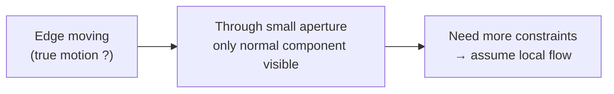
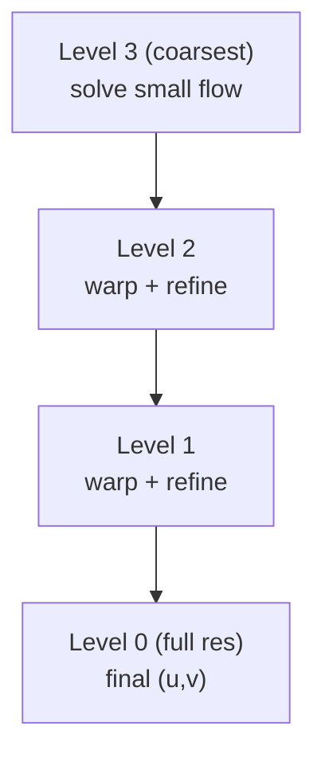

# 06 — Optical Flow

Once we can detect and describe features (Module 04) and recover pose from correspondences (Module 05), the next question is: how do those features *move* between consecutive frames? Optical flow estimates per-pixel (or per-feature) apparent motion in the image, giving us the temporal links that VO/SLAM stitch into a trajectory. This module sits on the spine between *features* and *two-view geometry*: it is how we cheaply track "the same thing" from frame to frame instead of re-detecting and re-matching everything.

## Brightness Constancy & the Flow Constraint

- **Assumption:** a small patch keeps the same intensity as it moves over a short time step. For a pixel at $(x,y)$ moving by $(u,v)$ between frames:

$$ I(x, y, t) = I(x + u,\; y + v,\; t + 1) $$

- First-order Taylor expansion of the right side gives the **optical-flow constraint equation (OFCE)**:

$$ I_x u + I_y v + I_t = 0 $$

  where $I_x, I_y$ are spatial gradients and $I_t$ is the temporal gradient (frame difference).

- **One equation, two unknowns** $(u, v)$ — under-determined per pixel. This is the **aperture problem**: through a small window you can only measure the flow component *along the gradient* (perpendicular to edges); motion *along* an edge is invisible.

## Lucas–Kanade

- **Idea:** assume flow $(u,v)$ is *constant over a small window* (e.g. $5\times5$). Each pixel in the window contributes one OFCE → an over-determined linear system.
- Stack the equations as $A\,[u\;v]^\top = -b$ where each row of $A$ is $[I_x\; I_y]$ and each entry of $b$ is $I_t$. Solve in least squares via the **normal equations**:

$$ A^\top A \begin{bmatrix} u \\ v \end{bmatrix} = -A^\top b $$

$$ \underbrace{\begin{bmatrix} \sum I_x^2 & \sum I_x I_y \\ \sum I_x I_y & \sum I_y^2 \end{bmatrix}}_{2\times2}\begin{bmatrix} u \\ v \end{bmatrix} = -\begin{bmatrix} \sum I_x I_t \\ \sum I_y I_t \end{bmatrix} $$

- **Key observation:** that $2\times2$ matrix $A^\top A$ is *exactly* the Harris structure (second-moment) matrix from Module 04. It is invertible — and the flow well-conditioned — only when both eigenvalues are large, i.e. at a **corner**.
- This is why **"good features to track"** are corners: the same eigenvalue test that finds Harris/Shi-Tomasi corners predicts which points LK can track reliably. Flat regions and straight edges fail (aperture problem made quantitative).

## Pyramidal LK (Large Motion)

- The Taylor expansion only holds for *small* displacements (sub-pixel to a few pixels). Fast motion or low frame rates break it.
- **Coarse-to-fine pyramid:** build an image pyramid (downsampled by 2 each level). Estimate flow at the coarsest level where motion is small, then **warp and propagate** the estimate down to finer levels, refining at each step.
- A large motion at full resolution becomes a small, solvable motion at the top of the pyramid.

## KLT Tracking vs Match-Every-Frame

- **KLT (Kanade–Lucas–Tomasi):** detect good features *once*, then track them frame-to-frame with pyramidal LK. The tracker just updates positions; no descriptors recomputed.
- **Detect-Describe-Match (DDM):** independently detect + describe (e.g. ORB) features in *every* frame and match by descriptor (Module 04).

| | KLT tracking | Match-every-frame |
|---|---|---|
| **Speed** | Fast (no descriptors, small search) | Slower (describe + match all) |
| **Drift** | Accumulates; tracks slowly slide | None per-frame (re-detected) |
| **Robustness** | Fragile to large motion, occlusion, lighting | Robust to large baselines, relocalization |
| **Wide baseline** | Poor | Good (descriptors are baseline-invariant) |

- **Practical rule:** KLT for high-frame-rate, smooth video (real-time VO front-ends); DDM when frames are far apart, motion is large, or you must relocalize. Many systems combine them — track with KLT, periodically re-detect and re-match to bound drift.

> **Key takeaway:** Optical flow turns brightness constancy into a solvable least-squares problem at corners, and the same structure matrix that finds good corners (Harris) tells us which points are good to track.

[← 05 PnP & Tracking](05_pnp_tracking.md) · [Index](../README.md) · [Next → 07 VO / SfM / SLAM](07_vo_sfm_slam.md)
