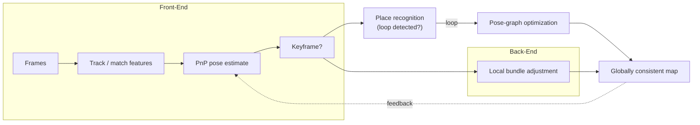
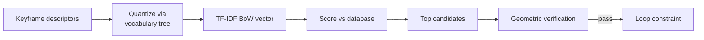

# 07 — Visual Odometry, SfM & SLAM

This module assembles everything so far — features, two-view init, triangulation, PnP tracking (Modules 04–05) — into systems that answer "where is the camera and what is it looking at?" over a whole trajectory. We distinguish three closely related problems (VO, SfM, SLAM), split each into a front-end and a back-end, and confront the central enemy of any incremental estimator: **drift**, and its cure, **loop closure**.

## VO vs SfM vs SLAM

- **Visual Odometry (VO):** *online, causal, incremental.* Estimate camera motion frame-by-frame from the local window. Like wheel odometry but with a camera — fast, but errors accumulate and there is **no global consistency** (no memory of revisited places).
- **Structure from Motion (SfM):** *offline, batch.* Given an unordered image collection, jointly reconstruct all cameras + 3D structure with no real-time constraint. Maximizes accuracy (e.g. photogrammetry, 3D reconstruction pipelines).
- **SLAM (Simultaneous Localization And Mapping):** *online mapping + localization with global consistency.* Like VO but maintains a persistent map and performs **loop closure** to stay globally consistent over long runs.

| | Causal? | Map? | Loop closure? |
|---|---|---|---|
| VO | Yes | Local only | No |
| SfM | No (batch) | Global | Implicit (global BA) |
| SLAM | Yes | Persistent global | Yes |

## Front-End vs Back-End

- **Front-end (data association + geometry):** feature tracking/matching, two-view initialization, triangulation, PnP pose estimation, outlier rejection (RANSAC), keyframe selection. Turns pixels into geometric constraints.
- **Back-end (optimization):** takes those constraints and refines poses (and points) to minimize error. Where bundle adjustment / pose-graph optimization live.

## Bundle Adjustment

- The gold-standard back-end: **jointly refine all camera poses $C_i$ and 3D points $X_j$** by minimizing total **reprojection error**:

$$ \min_{\{C_i\},\,\{X_j\}} \sum_{i,j} \rho\!\left( \big\| x_{ij} - \pi(C_i, X_j) \big\|^2 \right) $$

  where $x_{ij}$ is the observed pixel of point $j$ in camera $i$, $\pi$ is the projection, and $\rho$ is a robust loss (e.g. Huber) for outliers.
- Solved with **sparse Levenberg–Marquardt**: the Jacobian is block-sparse (each observation touches one camera + one point), so the normal equations have an arrowhead structure exploited via the **Schur complement** — making large problems tractable.
- **Local/windowed BA** (a sliding window of recent keyframes) keeps it real-time; **global BA** runs occasionally or after loop closure.

## Pose-Graph Optimization

- Cheaper alternative for large-scale correction: **optimize only the poses**, not the 3D points.
- Nodes = camera poses; edges = **relative-pose constraints** (from odometry or loop closures). Minimize:

$$ \min_{\{C_i\}} \sum_{(i,j)} \big\| \log\!\big( \Delta_{ij}^{-1}\, C_i^{-1} C_j \big) \big\|^2_{\Sigma_{ij}} $$

- Far fewer variables than BA → ideal for **redistributing drift** the instant a loop is closed. Often a pose-graph correction is followed by a full BA to polish.

## Drift & Loop Closure

- **Drift:** because VO/SLAM is incremental, each pose is estimated relative to the previous one, so small errors *accumulate* — the trajectory slowly bends away from truth, and monocular systems also suffer **scale drift** (Module 08).
- **Loop closure:** when the camera **revisits a place**, recognize it, add a constraint linking the current pose to the old one, and let the back-end **redistribute the accumulated error** around the loop — snapping the map back into global consistency.

## Place Recognition (Bag of Visual Words)

- To detect loops we need fast image-level similarity search over thousands of past keyframes. **Bag of Visual Words (BoVW / DBoW)** does this:
  - **Vocabulary:** cluster many training descriptors (e.g. k-means) into "visual words". A hierarchical **vocabulary tree** allows fast descriptor → word quantization.
  - **Representation:** each image becomes a sparse histogram over visual words (a BoW vector), discarding geometry for speed.
  - **TF-IDF weighting:** words that are frequent in an image but rare across the database get higher weight — distinctive words dominate the score.
  - **Scoring:** compare BoW vectors (e.g. $L_1$ / cosine) to retrieve loop-closure candidates, then **geometrically verify** (RANSAC + PnP/epipolar) before adding the constraint.

## See it in action

Watch a live monocular SLAM run that shows feature tracking, incremental mapping, and a loop closure snapping the trajectory back into global consistency: https://www.youtube.com/watch?v=Lc7VQHngSuQ

> **Key takeaway:** VO, SfM, and SLAM share a front-end/back-end structure where bundle adjustment minimizes reprojection error and loop closure (via bag-of-words place recognition) is what defeats accumulated drift.

[← 06 Optical Flow](06_optical_flow.md) · [Index](../README.md) · [Next → 08 Sensor Fusion & VIO](08_sensor_fusion_vio.md)
