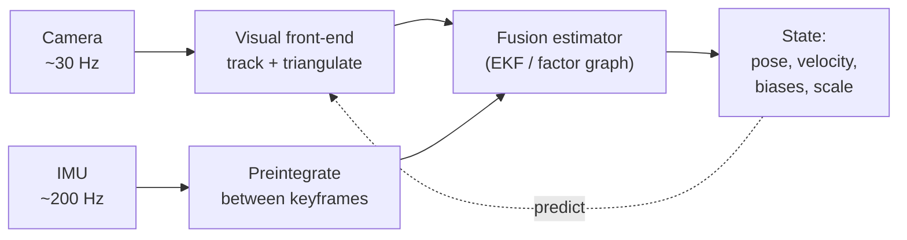

# 08 — Sensor Fusion & Visual-Inertial Odometry

Pure visual odometry (Module 07) is accurate but fragile: it drifts, breaks under fast motion or texture-less scenes, and — for a single camera — cannot recover *metric* scale. Adding an inertial sensor (IMU) fixes exactly these weaknesses. This final node on the spine fuses vision with inertial measurements to produce robust, metric, high-rate state estimates — the standard for drones, AR headsets, and humanoid robots.

## Why Pure Vision Is Not Enough

- **Monocular scale ambiguity:** from images alone, a small object nearby and a large object far away project identically. The whole reconstruction is correct only **up to an unknown scale factor** — you get shape, not metric size.
- **Scale drift:** even when initialized, that scale is not anchored and slowly changes along the trajectory.
- **Fragility:** motion blur, low texture, occlusion, or rapid rotation can stall tracking entirely — vision has *gaps*.

## The IMU

- An Inertial Measurement Unit combines:
  - **Gyroscope** — measures angular velocity $\omega$.
  - **Accelerometer** — measures specific force (acceleration **plus gravity**).
- Both run at high rate (100–1000 Hz), far faster than a camera.
- **Integrating** angular velocity gives orientation; double-integrating acceleration (after removing gravity) gives position:

$$ R_{t+1} = R_t \,\mathrm{Exp}(\omega\,\Delta t), \qquad v_{t+1} = v_t + (R_t a - g)\,\Delta t $$

- **Bias and noise:** each sensor has slowly-varying **biases** $b_g, b_a$ plus white noise. Raw integration of these errors makes IMU-only pose diverge in *seconds* — the IMU is great short-term, terrible long-term (the mirror image of vision).

## IMU Preintegration

- Naively, re-integrating raw IMU between two keyframes every time their poses change in optimization is expensive.
- **Preintegration** summarizes all IMU samples between two keyframes into a *single relative-motion constraint* ($\Delta R, \Delta v, \Delta p$) expressed **independent of the absolute pose**, with first-order corrections for bias updates.
- This lets the back-end add a cheap **IMU factor** between keyframes without re-touching every raw sample — the key trick behind modern optimization-based VIO.

## Vision and IMU Are Complementary

| Provides | IMU | Vision |
|---|---|---|
| Metric scale | Yes (gravity-anchored) | No (monocular) |
| Gravity direction (roll/pitch) | Yes (observable) | No |
| High-rate motion | Yes (~kHz) | No (~30 Hz) |
| Long-term drift correction | No | Yes |
| Robust under fast motion | Yes | No |

- **IMU → vision:** supplies metric scale, an absolute gravity/up direction, and motion prediction through visual gaps.
- **Vision → IMU:** bounds the otherwise-exploding integration drift and observes/corrects the biases.

## Fusion Architectures

- **Loosely coupled:** run vision and IMU as separate black boxes, then fuse their *outputs* (e.g. a VO pose + an IMU pose) in a filter. Simpler, but discards cross-information and is less accurate.
- **Tightly coupled:** fuse at the level of *raw measurements* — feature reprojections and IMU constraints enter one joint estimator. More accurate and robust; the modern standard.

Two families of estimators:

- **Filtering / EKF-based — e.g. MSCKF (Multi-State Constraint Kalman Filter):** maintain the state (pose, velocity, biases) and a sliding window of past camera poses; feature tracks impose multi-view constraints across them. Constant-time per update, light on memory — good for embedded/real-time.
- **Optimization / factor-graph — e.g. VINS-Mono, OKVIS, ORB-SLAM3:** build a factor graph with **reprojection factors** and **preintegrated IMU factors**, solve by nonlinear least squares over a window (bundle adjustment + IMU). More accurate (relinearizes), at higher compute cost.

## Camera–IMU Calibration

- Fusion is only as good as the alignment between sensors. Two things must be calibrated:
  - **Extrinsics** — the rigid transform $T_{CI}$ (rotation + translation) between camera and IMU frames.
  - **Time offset** $t_d$ — cameras and IMUs are rarely hardware-synchronized; a few milliseconds of skew badly corrupts tightly-coupled fusion, so the offset is estimated (e.g. with Kalibr) or even **online** as part of the state.

> **Key takeaway:** An IMU supplies the metric scale, gravity direction, and high-rate motion that monocular vision lacks, while vision bounds inertial drift — and tightly-coupled fusion (EKF or factor-graph, with preintegrated IMU factors) combines them into a robust metric state estimate.

[← 07 VO / SfM / SLAM](07_vo_sfm_slam.md) · [Index](../README.md) · [Next → 09 3D Reconstruction](09_3d_reconstruction.md)
