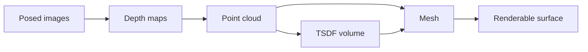

# 09 — 3D Reconstruction

So far the Visual-Odometry/SLAM spine has answered "where is the camera?" using **sparse** points — a handful of triangulated landmarks. This module pushes toward "what is it looking at?" at a denser level of abstraction: recovering full **3D geometry** of the scene. We climb the representation ladder (point cloud → mesh → volumetric TSDF) and finish at the modern frontier where classical reconstruction meets learning (NeRF, 3D Gaussian Splatting).

## From Sparse to Dense

- Sparse SLAM/SfM gives you camera poses + a thin point cloud of feature matches.
- **Dense reconstruction** estimates depth for (nearly) *every* pixel, yielding surfaces you can render, collide against, or plan over.
- Given known poses (from VO/SLAM), the problem reduces to **per-pixel depth estimation** + **fusion** across views.

## Stereo & Disparity

- Two cameras with a known **baseline** $B$ see the same scene from slightly shifted viewpoints.
- **Rectification:** warp both images so epipolar lines are horizontal and aligned. After rectification, a point in the left image at row $v$ matches somewhere along the *same row* in the right image — reducing the 2D search to 1D.
- **Disparity** $d = u_L - u_R$ is the horizontal pixel shift of a matched point. Nearer objects shift more.
- Depth follows from similar triangles:

$$ Z = \frac{f \, B}{d} $$

where $f$ is focal length (pixels), $B$ the baseline (meters), $d$ the disparity (pixels).

- Consequences:
  - Disparity → depth is **nonlinear**: far points have tiny $d$, so depth resolution degrades with range.
  - Larger $B$ improves far-range accuracy but shrinks the overlapping field of view and hurts near range.
  - **Textureless / repetitive** regions break matching → holes in the disparity map.
- Block-matching (SAD/SSD) or **Semi-Global Matching (SGM)** add a smoothness prior along multiple scan directions for cleaner maps.

## Multi-View Stereo (MVS)

- Generalizes stereo to **many** posed images instead of a calibrated pair.
- Core idea: for each pixel, hypothesize depths and test **photometric consistency** across all views that see it (plane-sweep, patch-based PatchMatch stereo, e.g. COLMAP MVS).
- Outputs a dense (often per-image) depth map, then fuses them into a global point cloud.
- Strong where there is texture and wide baselines with good overlap; struggles on glossy/transparent surfaces.

## 3D Representations: the Progression

- **Point cloud:** unordered 3D points (optionally colored). Simple, but no connectivity, no surface, noisy.
- **Mesh:** vertices + faces (triangles). Compact watertight surface; good for rendering/physics; needs a meshing step.
- **TSDF (Truncated Signed Distance Function):** a **volumetric** grid where each voxel stores the *signed distance* to the nearest surface (positive in front, negative behind, truncated near zero crossing).
  - **Volumetric fusion:** integrate many depth maps into the grid by weighted averaging of distances — noise cancels, surfaces sharpen incrementally.
  - **KinectFusion** popularized real-time TSDF fusion from a moving depth camera; the surface is the **zero level-set**, extracted via marching cubes.

## Modern Frontier: Neural & Differentiable Scenes

Where classical reconstruction hand-builds geometry, learned methods **optimize a scene representation directly from images** by differentiable rendering.

- **NeRF (Neural Radiance Fields):**
  - An **implicit** MLP maps a 3D point + viewing direction $(\mathbf{x}, \mathbf{d})$ to color $\mathbf{c}$ and density $\sigma$.
  - **Volume rendering** integrates color and density along each camera ray:

  $$ C(\mathbf{r}) = \int_{t_n}^{t_f} T(t)\,\sigma(t)\,\mathbf{c}(t)\,dt, \quad T(t) = \exp\!\Big(-\!\int_{t_n}^{t} \sigma(s)\,ds\Big) $$

  - Trained by comparing rendered pixels to real ones. Photorealistic novel views; classically **slow** to train and render.
- **3D Gaussian Splatting:**
  - **Explicit** scene = millions of anisotropic 3D **Gaussians**, each with position, covariance (shape/orientation), opacity, and view-dependent color.
  - **Fast differentiable rasterization** ("splatting") projects and blends Gaussians instead of ray-marching an MLP — real-time rendering, fast optimization.
- Both need **posed images** (typically from classical SfM/SLAM), so the geometric spine still underpins the learned frontier.

> **Key takeaway:** Dense reconstruction lifts SLAM from sparse landmarks to full surfaces, climbing point cloud → mesh → TSDF and now to differentiable neural/Gaussian scenes built on top of classically estimated poses.

[← 08 Sensor Fusion & VIO](08_sensor_fusion_vio.md) · [Index](../README.md) · [Next → 10 CNNs & Semantics](10_cnns_and_semantics.md)
