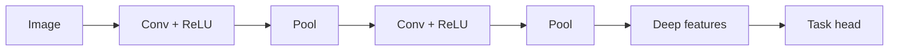
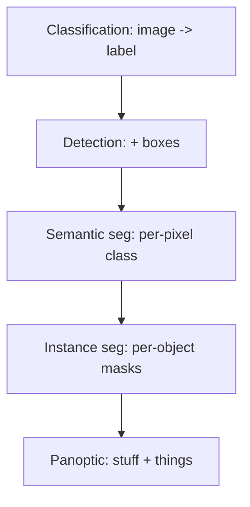

# 10 — CNNs & Semantics

This is the **ML branch** of the course. The classical Visual-Odometry/SLAM spine answered "where is the camera and what is it looking at" using hand-crafted geometry. Here that spine **branches off** into learning: convolutional networks replace hand-crafted features, add *semantic* meaning ("that pixel is a car"), and increasingly fuse back into geometric SLAM. The two threads diverge in this module — then reconverge in **semantic SLAM**.

## Learned Features Replace Hand-Crafted Ones

- Classical pipelines used **SIFT/ORB + ratio-test matching** (Module 04). Learned front-ends now often outperform them, especially under viewpoint/illumination change.
- **SuperPoint:** a single CNN that **self-supervises** keypoint detection + descriptors.
  - Trained first on synthetic corners (MagicPoint), then via **homographic adaptation** (warp an image many ways, keep points that survive) to label real images without human annotation.
  - Outputs a keypoint heatmap + dense descriptor map in one forward pass.
- **SuperGlue:** learns the **matching** step itself.
  - An **attention-based Graph Neural Network** reasons jointly over two keypoint sets (self-attention within an image, cross-attention between images).
  - Solves an **optimal-transport** assignment with a dustbin for unmatched points — handling occlusion and repeats far better than nearest-neighbor + ratio test.
- Drop-in upgrade: SuperPoint + SuperGlue can feed the *same* geometric estimators (Essential matrix, PnP, BA) the classical spine already uses.

## CNN Basics

- **Convolution:** slide a small learnable kernel over the image; each output measures local pattern response. Shares weights → translation-equivariant and parameter-efficient.
- **Nonlinearity (ReLU):** $\max(0, x)$ adds expressive power between conv layers.
- **Pooling / strided conv:** downsample spatially → larger receptive field, fewer parameters, mild invariance to position.
- **Hierarchical features:** early layers learn edges/blobs; mid layers learn textures/parts; deep layers learn object-level concepts. Depth builds abstraction.

## The Vision Task Ladder

Increasing spatial/semantic granularity:

- **Image classification:** one label for the whole image ("kitchen").
- **Object detection:** a **bounding box** + class per object ("3 chairs, here, here, here").
- **Semantic segmentation:** a **per-pixel class** label, but instances merge ("all road pixels," no separation between cars).
- **Instance segmentation:** per-pixel masks that also **separate individual objects** ("car #1 vs car #2").
- **Panoptic segmentation:** unifies both — **"stuff"** (semantic regions: road, sky) **+ "things"** (countable instances), every pixel gets exactly one (class, instance) tag.

## Semantic SLAM — Where the Branches Refuse

- Classical SLAM builds a **geometric** map (points, surfaces) with no notion of *what* things are.
- **Semantic SLAM** fuses CNN labels into the map so landmarks/voxels carry **object/class identity**.
- Benefits:
  - **Robust data association:** "this is the same chair" beats raw descriptor matching across large viewpoint changes.
  - **Outlier rejection / dynamic handling:** down-weight points on movable objects (people, cars) that violate the static-world assumption.
  - **Higher-level maps:** object-level SLAM enables planning, manipulation, and human-readable scene graphs.
- The trend is **fusion**, not replacement: learned perception supplies associations and priors; geometric optimization (BA, pose graphs) still enforces consistency.

> **Key takeaway:** The ML branch swaps hand-crafted features for learned ones and adds per-pixel semantic meaning, and through semantic SLAM it folds that meaning back into the classical geometric map.

[← 09 3D Reconstruction](09_3d_reconstruction.md) · [Index](../README.md) · [Next → 11 Hardware](11_hardware.md)
