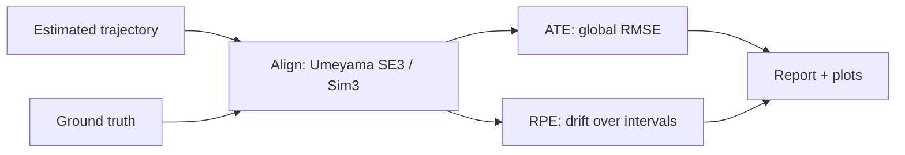

# 12 — Evaluation

The whole Visual-Odometry/SLAM spine claims to answer "where is the camera?" — this module asks **how well**. Estimating a trajectory is meaningless without rigorous, comparable measurement against ground truth. Here we cover the standard benchmark **datasets**, the two core **metrics** (ATE and RPE), the all-important **alignment** step, and the tooling that ties it together.

## Benchmark Datasets

- **KITTI:** outdoor **autonomous driving**. Stereo cameras + Velodyne **LiDAR** + GPS/INS ground truth. Long trajectories, dynamic objects, real-world scale — the standard for driving-scale VO/SLAM.
- **EuRoC MAV:** indoor **micro-drone** flights. Stereo + synchronized **IMU**, with millimeter-accurate motion-capture / laser ground truth. The reference benchmark for **visual-inertial** odometry.
- **TUM RGB-D:** indoor **handheld** RGB-D sequences with motion-capture ground-truth poses. Classic for RGB-D SLAM and the origin of the widely used ATE/RPE evaluation conventions.

## Core Metrics

### Absolute Trajectory Error (ATE)

- Measures **global** consistency: how far the whole estimated trajectory deviates from ground truth after best alignment.
- Steps: align estimate to ground truth (see below), then take the RMSE of per-pose **position** differences:

$$ \mathrm{ATE}_{\text{RMSE}} = \sqrt{\frac{1}{N} \sum_{i=1}^{N} \big\lVert \mathbf{t}_i^{\text{est,aligned}} - \mathbf{t}_i^{\text{gt}} \big\rVert^2 } $$

- Good single number for overall accuracy; sensitive to a few large errors and to the alignment.

### Relative Pose Error (RPE)

- Measures **local** accuracy / **drift** over fixed intervals $\Delta$ (e.g. per meter or per second), not global pose.
- For each interval, compare the relative motion of estimate vs ground truth:

$$ E_i = \big( T_i^{\text{gt}-1} T_{i+\Delta}^{\text{gt}} \big)^{-1} \big( T_i^{\text{est}-1} T_{i+\Delta}^{\text{est}} \big) $$

then aggregate the translational/rotational parts as RMSE.
- Largely **invariant to global alignment**; ideal for quantifying VO drift rate.

## The Alignment Step

- Estimated and ground-truth trajectories live in **different reference frames** — you must align before comparing positions.
- **Umeyama's method** finds the optimal rigid (or similarity) transform in closed form by least squares.
  - **SE(3)** alignment (rotation + translation) when scale is known (stereo, RGB-D, VIO).
  - **Sim(3)** alignment (adds a **scale** factor) for **monocular** systems, which are scale-ambiguous and recover geometry only up to an unknown scale.

## Tooling

- **evo** is the de-facto toolkit: parses KITTI/EuRoC/TUM formats, performs Umeyama SE(3)/Sim(3) alignment, computes **ATE** (`evo_ape`) and **RPE** (`evo_rpe`), and produces trajectory plots and statistical comparisons across runs.
- Conceptually: load estimate + ground truth → align → compute metric → report RMSE/mean/median + plots. Always report **whether and how** you aligned (SE(3) vs Sim(3)), since it changes the numbers.

> **Key takeaway:** Sound SLAM evaluation aligns the estimate to ground truth (SE(3), or Sim(3) for monocular scale) and reports ATE for global accuracy and RPE for local drift on standard datasets like KITTI, EuRoC, and TUM RGB-D.

[← 11 Hardware](11_hardware.md) · [Index](../README.md)
